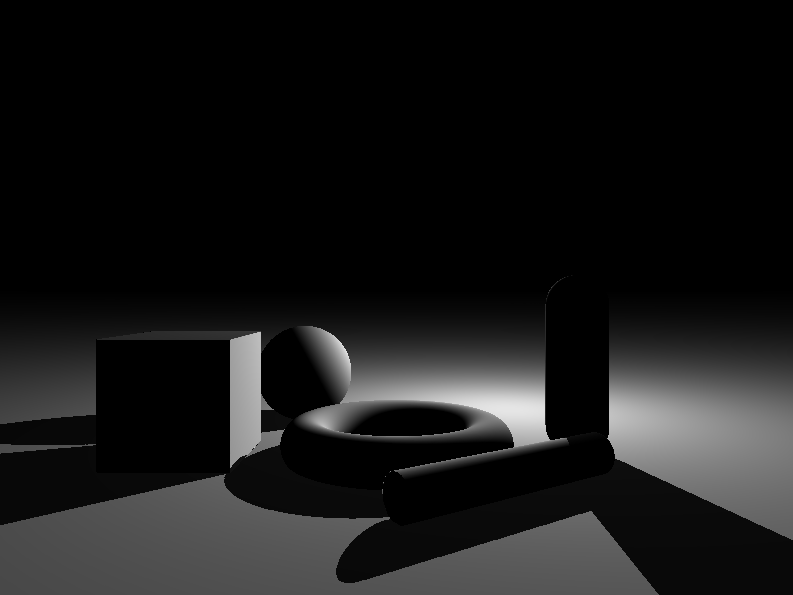

# Caster

Playing around with [ray marching](http://jamie-wong.com/2016/07/15/ray-marching-signed-distance-functions/), [signed distance functions](https://en.wikipedia.org/wiki/Signed_distance_function), and WebGL.

## Running

    npm i
    make start

or
    npm i
    npm run start

## Format

Example:

    caster([
        scene([
            draw(
                sphere([3.5, 1, 10], [1]),
                [0, 1, 1, 1]
            ), 
            draw(
                sphere([-3.5, 1, 10], [1]),
                [1, .5, 0, 1]
            ),
            repeat([4, 0, 4]),
            draw(
                join([
                    cube([-.2, -1, 0], [.2, .2, .2]),
                    sphere([0, -1, 0], [.2]),
                    smoothUnion([.4]),
                    cube([.2, -1, 0], [.2, .2, .2]),
                    smoothUnion([.4]),
                ]),
            [1, .5, 1, 1] 
            ),
            single(),
            draw(ground([0, -2, 0])),
        ]),
        lights([
            light([0, 20, 0], [.5, .5, .5, 1]),
            light([0, 2.5, 0], [1, 1, 1, 1])
        ]),
    ]);
